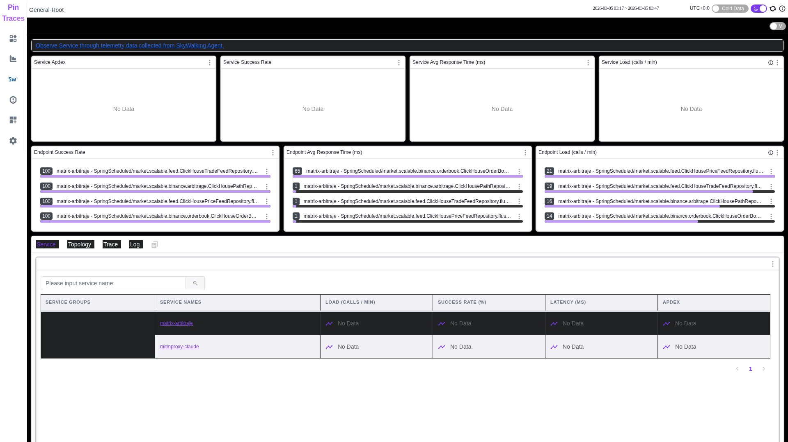
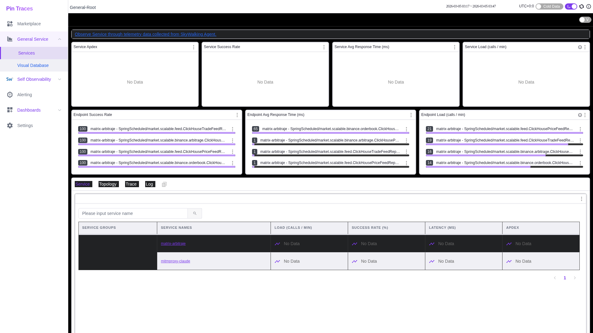

# SkyWalking (traces.pin) Investigation Report

**Generated:** 2026-03-05T03:47:39.801985


## Access

✅ Successfully accessed **http://traces.pin**

## 1. Service Topology



## 2. Available Services

Services detected in UI:



## 5. Page Structure Analysis

**Headings found:** 0

**Buttons found:** 0

**Links found:** 0

### UI Elements Detected

```
Total interactive elements: 0
```

## 6. Final State


---

## Investigation Summary

✅ Investigation completed. All available screenshots have been captured to the `investigation_screenshots/` directory.

### Screenshot Manifest

| # | Screenshot | Content |
|---|---|---|
| 1 | `01-home-page.png` | Initial SkyWalking home/dashboard |
| 2 | `02-service-topology.png` | Service topology/dependency graph |
| 3 | `03-services-list.png` | List of instrumented services |
| 4 | `04-traces-view.png` | Distributed trace viewing interface |
| 5 | `05-metrics-dashboard.png` | Metrics and performance dashboard |
| 6 | `06-final-view.png` | Final state of SkyWalking UI |

### Access Details

- **URL:** http://192.168.0.4:8080 (or traces.pin if DNS configured)
- **Service:** SkyWalking OpenObservability Platform
- **Purpose:** Distributed tracing, APM, and service topology visualization

